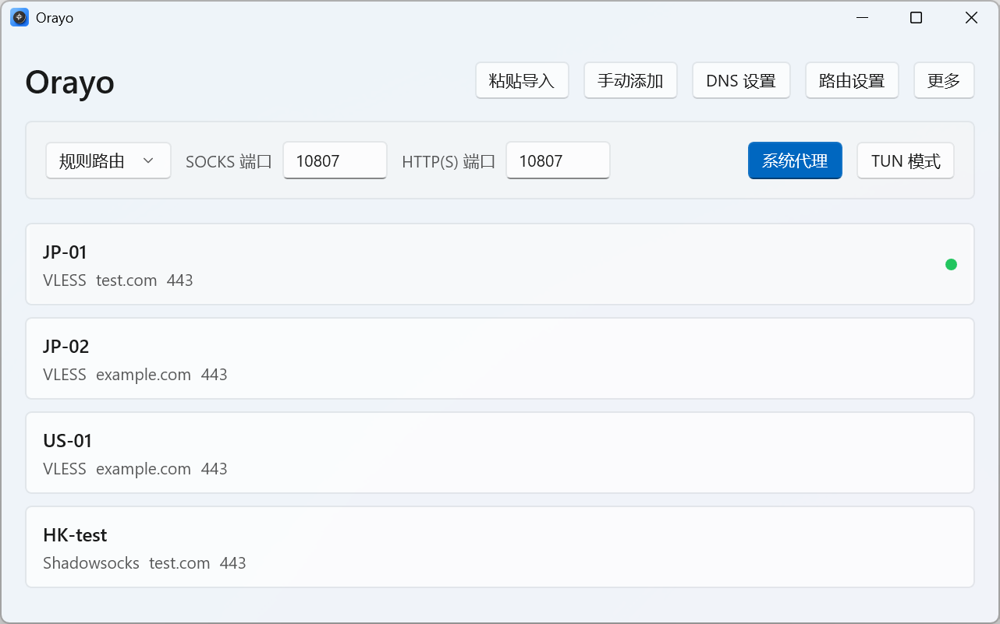

# Orayo

Orayo is a modern Windows Xray client built with WinUI 3.

## Features

- Xray-core integration
- Node list with import, add, edit, delete, and share
- TUN mode and system proxy
- Routing and DNS settings
- Geo data file updates

## ScreenShots


## Build

Requires .NET 8 SDK and Windows 10 19041 or later.

```bash
dotnet build -c Release
```

## License

GPL-3.0