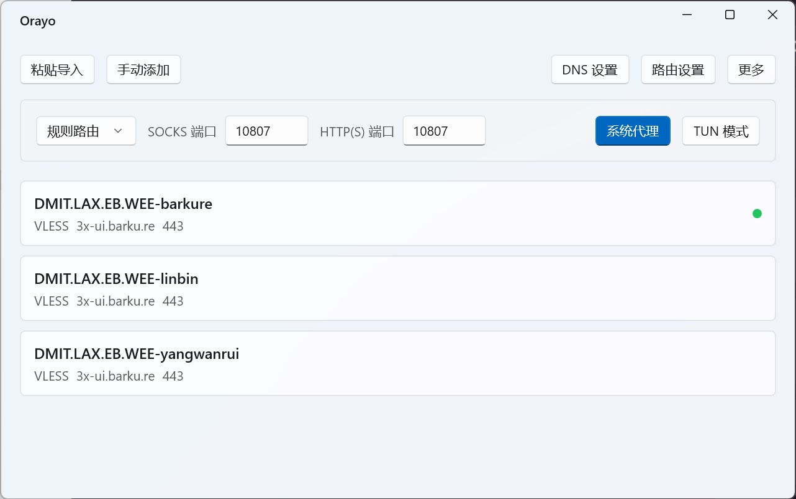
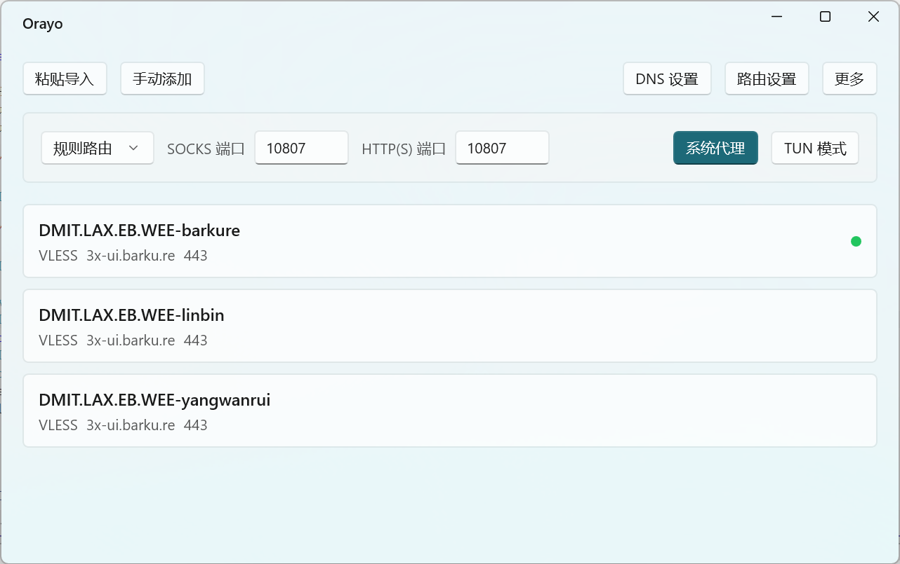
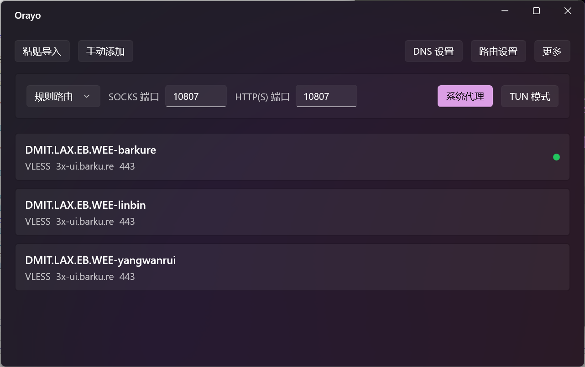
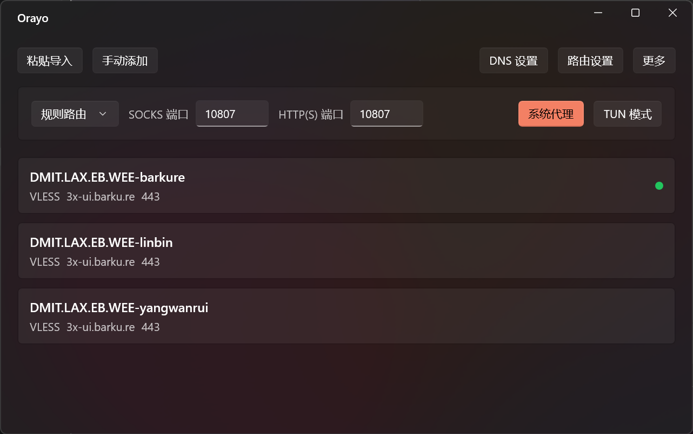

# Orayo

Orayo is a modern Windows Xray client built with WinUI 3.

## Features

- Xray-core integration
- Node list with import, add, edit, delete, and share
- TUN mode and system proxy
- Routing and DNS settings
- Geo data file updates

## Screenshots
<table>
  <tr>
	<td></td>
	<td></td>
  </tr>
  <tr>
	<td></td>
	<td></td>
  </tr>
</table>

## Build

Requires .NET 8 SDK and Windows 10 1809 or later. Windows 10 2004 or later is recommended.

```bash
dotnet build -c Release
```

## Open Source Projects Used

- [Xray-core](https://github.com/XTLS/Xray-core)
- [Wintun](https://www.wintun.net/)
- [Loyalsoldier/v2ray-rules-dat](https://github.com/Loyalsoldier/v2ray-rules-dat)
- [Monaco Editor](https://github.com/microsoft/monaco-editor)

## License

GPL-3.0
