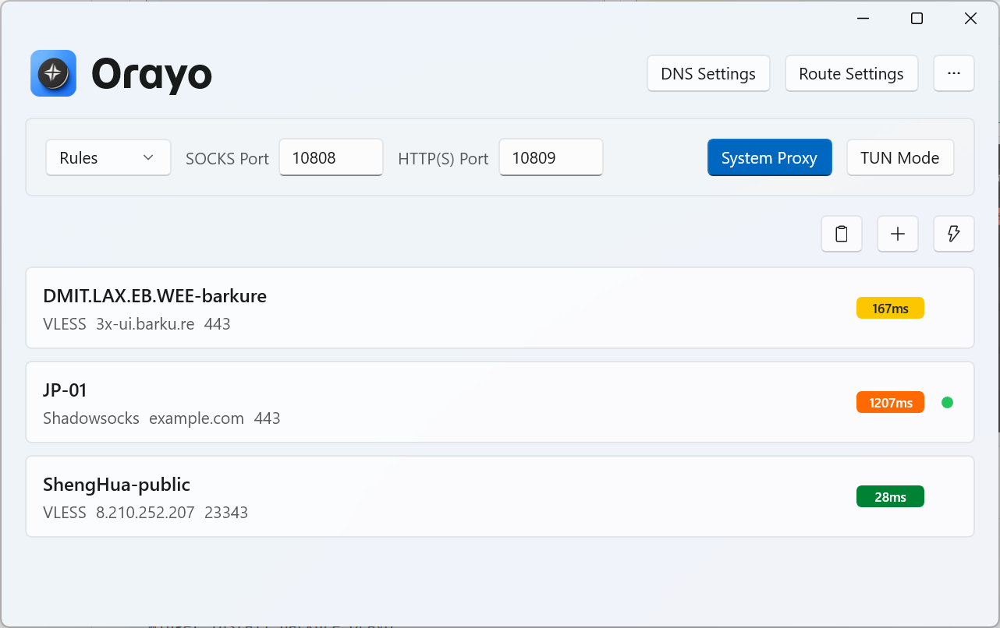
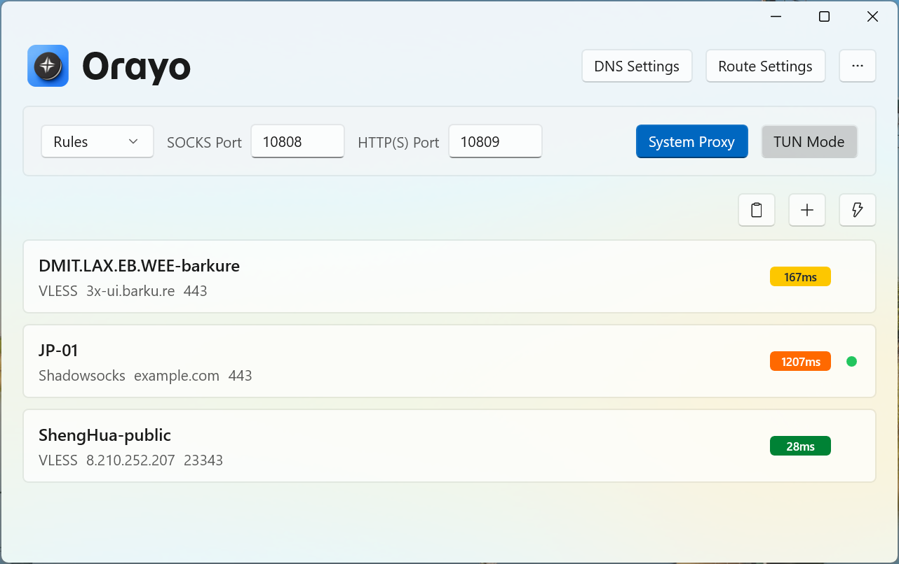
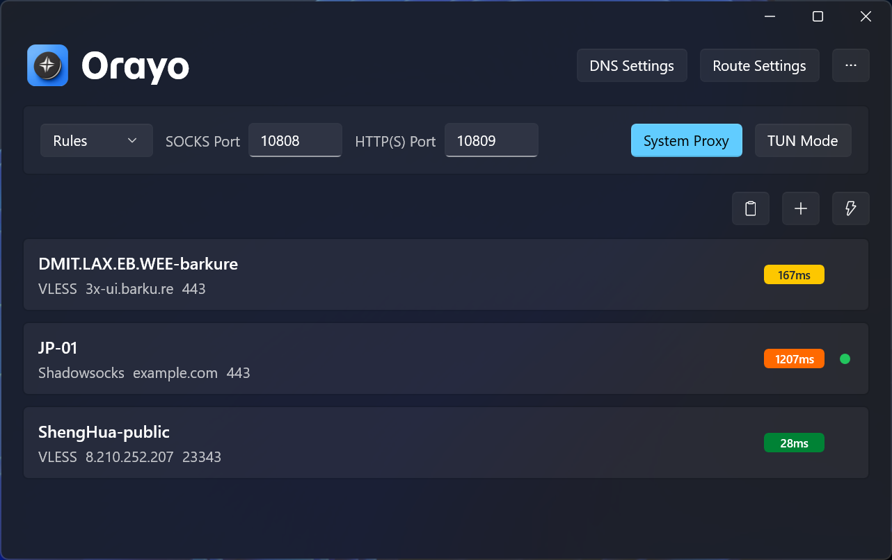
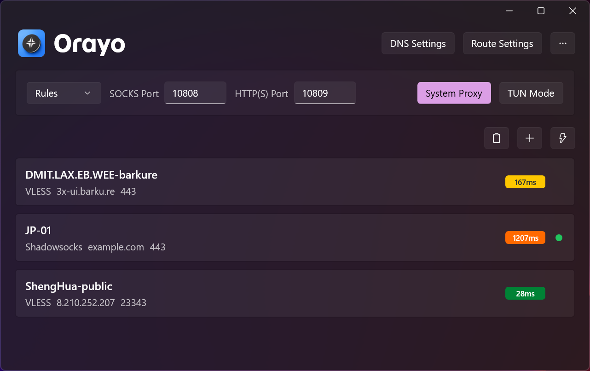

[English](README.md) | [简体中文](README.zh-Hans.md)

# Orayo

<picture>
  <source media="(prefers-color-scheme: dark)" srcset="./docs/assets/banner-dark.webp">
  <source media="(prefers-color-scheme: light)" srcset="./docs/assets/banner-light.webp">
  
</picture>

Orayo is a modern Windows Xray client built with WinUI 3.

## Features

- Xray-core integration
- Node list with import, add, edit, delete, and share
- TUN mode and system proxy
- Routing and DNS settings
- Geo data file updates

## Screenshots
<table>
  <tr>
	<td></td>
	<td></td>
  </tr>
  <tr>
	<td></td>
	<td></td>
  </tr>
</table>

## Installation

### WinGet

```bash
winget install barkure.Orayo
```

### Release

[Latest Release](https://github.com/barkure/Orayo/releases/latest): Setup (requires installation) and Portable (run directly, no installation needed).

### Configuration and data

- **Setup** stores user data in `%LocalAppData%\Orayo`, preserving the existing location.
- **Portable** stores user data in `data` at the portable package root. Velopack puts the executable in `current`; `data` sits beside that replaceable directory and survives application updates.
- **Development builds** use `%LocalAppData%\Orayo` rather than the build output directory.

This includes nodes, settings, runtime state, backups, the normal-mode Xray configuration, crash logs, and staged core updates. Extract Portable into a writable folder; failed saves do not silently fall back to AppData.

To keep settings from an older Portable release, exit Orayo and copy `servers.json`, `settings.json`, `runtime_state.json`, and their `.bak` files from `%LocalAppData%\Orayo` into the new package's `data` directory before launching it. Existing data is never automatically moved or deleted. There is no subscription management or subscription-file cleanup.

The elevated TUN helper uses a temporary configuration in the system temporary directory and deletes it when stopped.

## Build Instructions

Requires .NET 10 SDK and Windows 10 1809 or later. Windows 10 2004 or later is recommended.

```bash
dotnet build Orayo.csproj -c Release
```

The core library builds and tests on Windows, Linux, and macOS with .NET 10:

```bash
dotnet build Orayo.Core/Orayo.Core.csproj -c Release
dotnet test tests/Orayo.Core.Tests/Orayo.Core.Tests.csproj -c Release
```

See [Architecture](docs/architecture.md) for responsibilities and dependency boundaries.

## Open Source Projects Used

- [Xray-core](https://github.com/XTLS/Xray-core)
- [Wintun](https://www.wintun.net/)
- [Loyalsoldier/v2ray-rules-dat](https://github.com/Loyalsoldier/v2ray-rules-dat)
- [Monaco Editor](https://github.com/microsoft/monaco-editor)

## License

GPL-3.0
