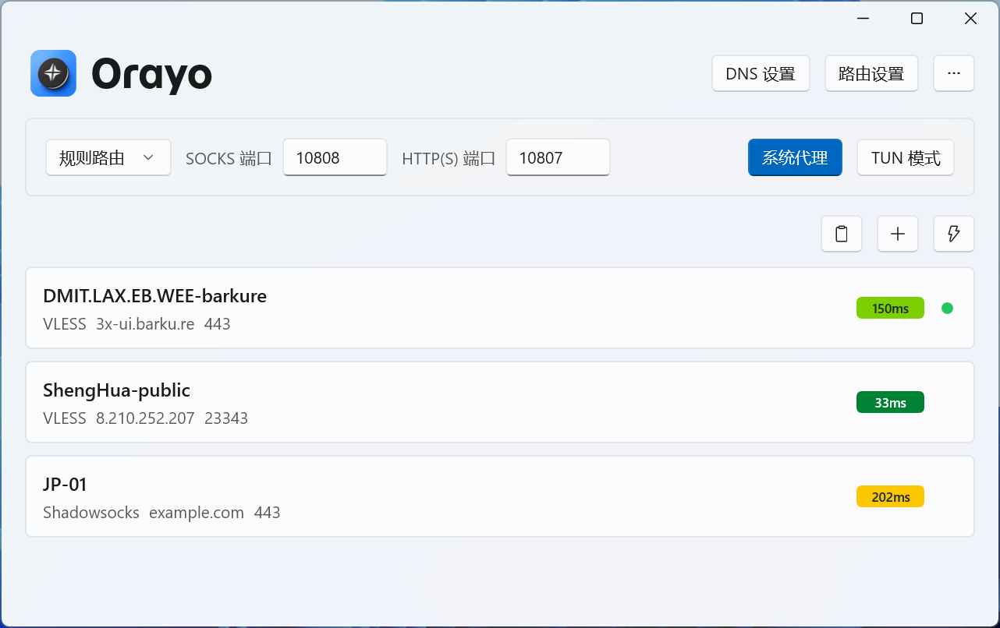
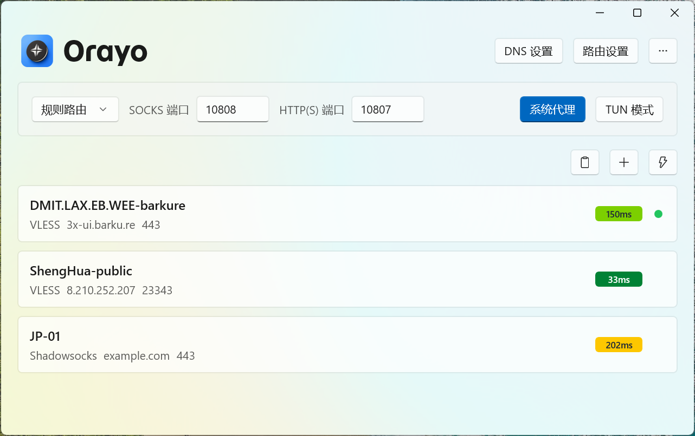
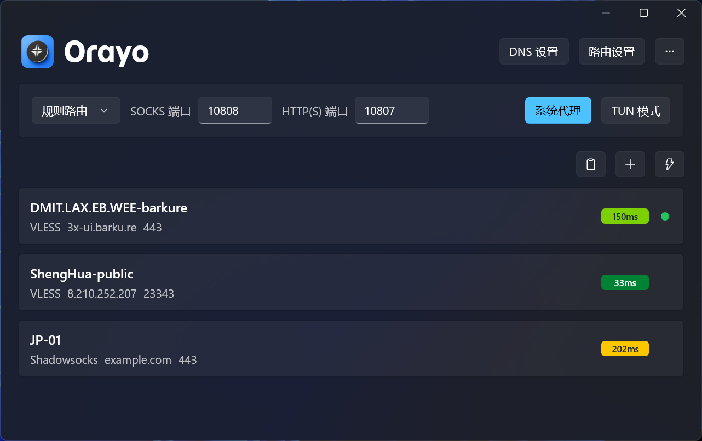
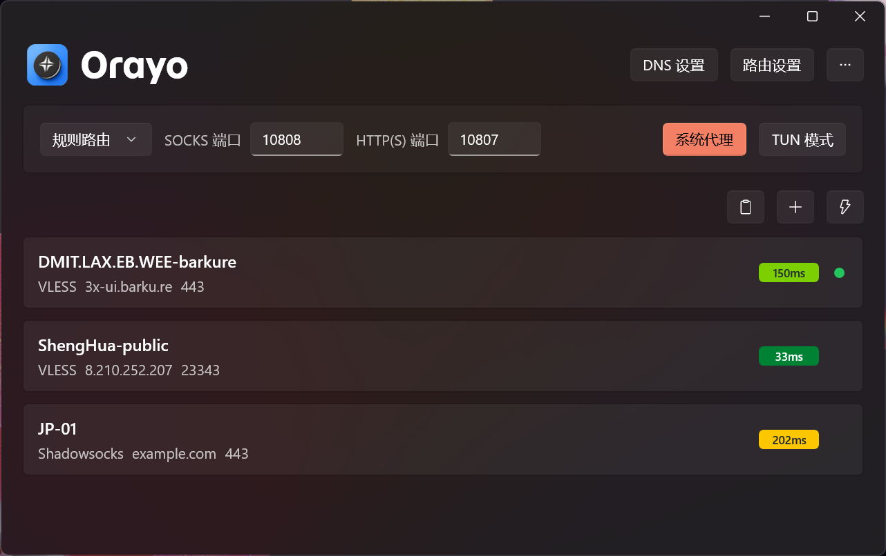

# Orayo

<picture>
  <source media="(prefers-color-scheme: dark)" srcset="./docs/assets/banner-dark.webp">
  <source media="(prefers-color-scheme: light)" srcset="./docs/assets/banner-light.webp">
  
</picture>

[English](README.md) | [简体中文](README.zh-Hans.md)

Orayo 是一款使用 WinUI 3 构建的现代化 Windows Xray 客户端。

## 功能

- Xray-core 集成
- 节点列表：导入、添加、编辑、删除、分享
- TUN 模式与系统代理
- 路由与 DNS 设置
- Geo 数据文件更新
- 中文 / English 双语言支持

## 截图

<table>
  <tr>
	<td></td>
	<td></td>
  </tr>
  <tr>
	<td></td>
	<td></td>
  </tr>
</table>

## 安装

### WinGet

```bash
winget install barkure.Orayo
```

### 发布页

[最新版本](https://github.com/barkure/Orayo/releases/latest)：Setup（需安装）和 Portable（直接运行，无需安装）。

## 构建

需要 .NET 8 SDK 及 Windows 10 1809 或更高版本。推荐 Windows 10 2004 及以上。

```bash
dotnet build -c Release
```

## 使用的开源项目

- [Xray-core](https://github.com/XTLS/Xray-core)
- [Wintun](https://www.wintun.net/)
- [Loyalsoldier/v2ray-rules-dat](https://github.com/Loyalsoldier/v2ray-rules-dat)
- [Monaco Editor](https://github.com/microsoft/monaco-editor)

## 许可证

GPL-3.0
