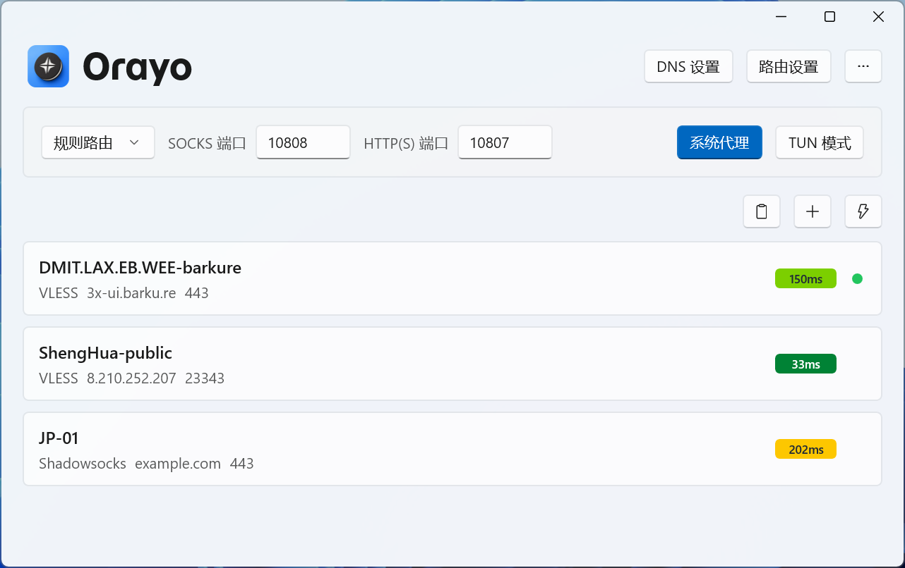
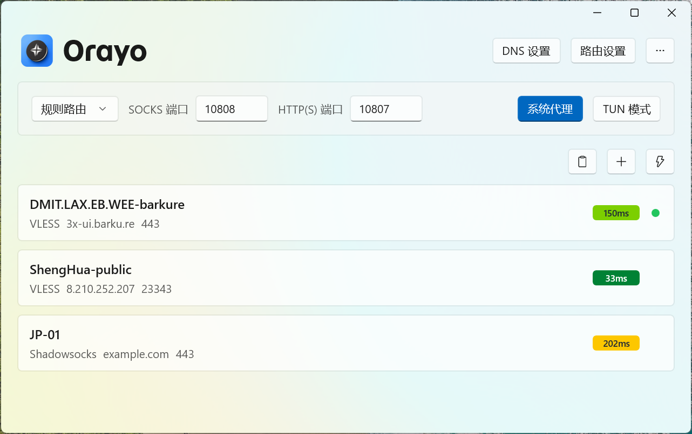
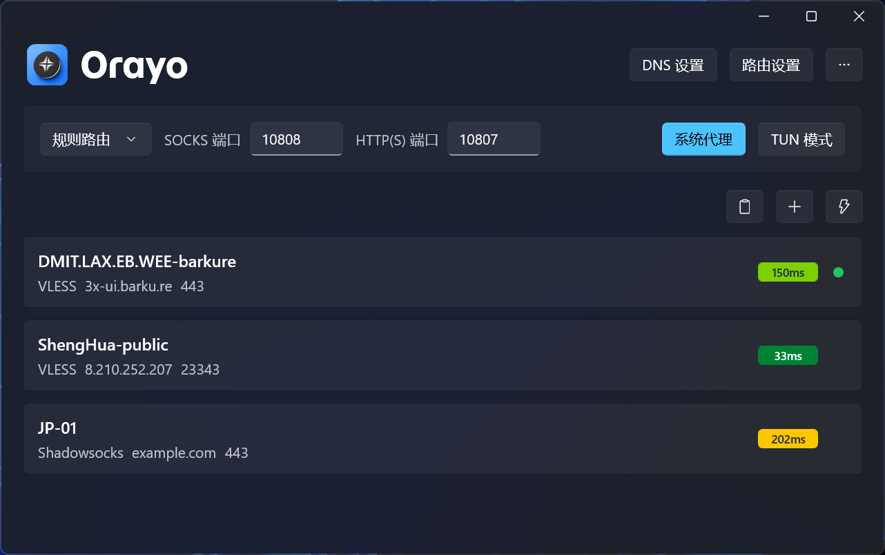
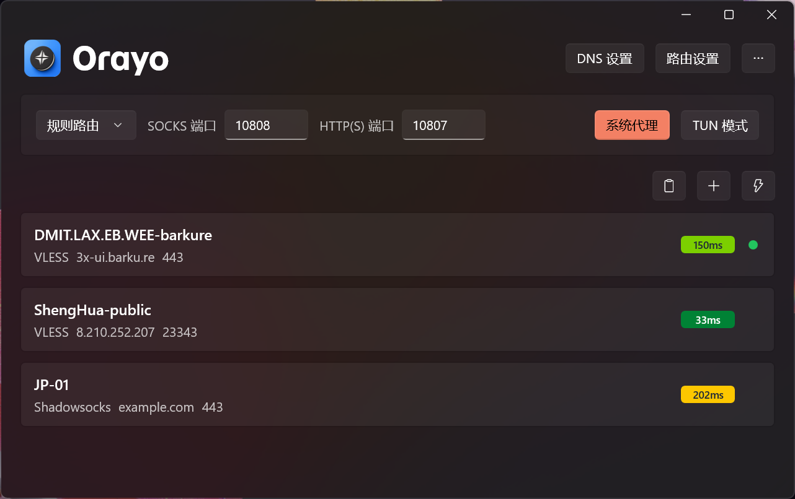

[English](README.md) | [简体中文](README.zh-Hans.md)

# Orayo

<picture>
  <source media="(prefers-color-scheme: dark)" srcset="./docs/assets/banner-dark.webp">
  <source media="(prefers-color-scheme: light)" srcset="./docs/assets/banner-light.webp">
  
</picture>

Orayo 是一款使用 WinUI 3 构建的现代化 Windows Xray 客户端。

## 功能

- Xray-core 集成
- 节点列表：导入、添加、编辑、删除、分享
- TUN 模式与系统代理
- 路由与 DNS 设置
- Geo 数据文件更新
- 中文 / English 双语言支持

## 截图

<table>
  <tr>
	<td></td>
	<td></td>
  </tr>
  <tr>
	<td></td>
	<td></td>
  </tr>
</table>

## 安装

### WinGet

```bash
winget install barkure.Orayo
```

### 发布页

[最新版本](https://github.com/barkure/Orayo/releases/latest)：Setup（需安装）和 Portable（直接运行，无需安装）。

### 配置与数据目录

- **Setup 安装版**：保存在 `%LocalAppData%\Orayo`，沿用原有配置位置。
- **Portable 便携版**：保存在便携包根目录的 `data` 文件夹。Velopack 包中的可执行文件位于 `current` 文件夹，`data` 与它同级，更新应用时不会被替换。
- **源码开发运行**：使用 `%LocalAppData%\Orayo`，避免把开发配置写入构建产物。

节点、应用设置、运行状态、备份、普通模式的 Xray 运行配置、崩溃日志和内核更新暂存数据均使用上述数据目录。便携版需解压到可写目录；保存失败时不会自动改用 AppData。

旧版 Portable 用户可在退出 Orayo 后，将 `%LocalAppData%\Orayo` 中的 `servers.json`、`settings.json`、`runtime_state.json` 及相应 `.bak` 文件复制到新便携包的 `data` 目录，再启动应用。程序不会自动搬移或删除旧配置，也没有订阅管理或订阅文件清理逻辑。

TUN 辅助进程的临时配置仍使用系统临时目录，并在停止时删除。

## 构建

需要 .NET 10 SDK 及 Windows 10 1809 或更高版本。推荐 Windows 10 2004 及以上。

```bash
dotnet build Orayo.csproj -c Release
```

核心逻辑独立于 WinUI，可在安装了 .NET 10 SDK 的 Windows、Linux 或 macOS 上构建和测试：

```bash
dotnet build Orayo.Core/Orayo.Core.csproj -c Release
dotnet test tests/Orayo.Core.Tests/Orayo.Core.Tests.csproj -c Release
```

代码职责与依赖方向见 [架构说明](docs/architecture.md)。

## 使用的开源项目

- [Xray-core](https://github.com/XTLS/Xray-core)
- [Wintun](https://www.wintun.net/)
- [Loyalsoldier/v2ray-rules-dat](https://github.com/Loyalsoldier/v2ray-rules-dat)
- [Monaco Editor](https://github.com/microsoft/monaco-editor)

## 许可证

GPL-3.0
